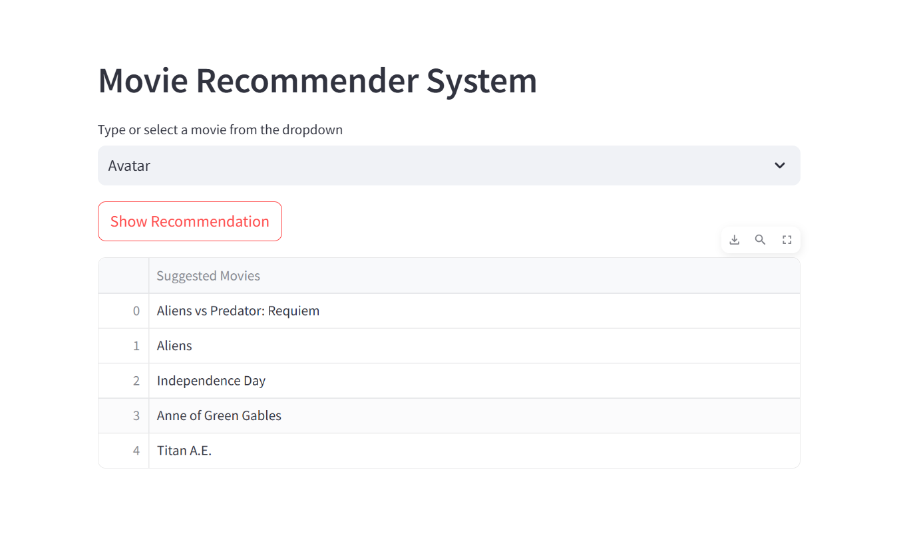

# Movie Recommender System with Streamlit

A simple and interactive movie recommender system built using Streamlit. This app recommends movies based on cosine similarity computed from movie features.

---

## Features

- User-friendly interface to select a movie title from a dropdown list.
- Recommends the top 5 similar movies based on content similarity.
- Uses precomputed cosine similarity for fast recommendations.
- Powered by Python libraries including Streamlit, pandas, numpy, scikit-learn, and nltk.

---

## Demo



---

## Installation

### Prerequisites
- Python
- pip (Python package manager)

### Setup

1. Clone the repository:

   ```bash
   git clone https://github.com/priteshramani/movie-recommender.git
   cd movie-recommender
   ```

2. Install dependencies:

   ```bash
   pip install -r requirements.txt
   ```

3. Run the app:

   ```bash
   streamlit run app.py
   ```

---

## Usage

- Launch the app using the command above.
- Select a movie from the dropdown list.
- Click the **Show Recommendation** button.
- View the top 5 movie recommendations based on your selection.

---

## Project Structure

```
├── app.py                    # Main Streamlit application script
├── movie_list.pickle         # Pickle file containing the movie dataset
├── cosine_similarity.pickle  # Pickle file containing computed cosine similarity matrix
├── requirements.txt          # Python dependencies list
└── README.md                 # Project documentation
```

---

## Dependencies

- streamlit
- numpy
- pandas
- scikit-learn
- nltk
- pickle

---

## Contributing

Contributions are welcome! Please fork the repository and submit a pull request for any improvements or bug fixes.

---

## License

This project is licensed under the MIT License.

---

## Acknowledgements

- Movie dataset used for recommendations.
- Inspired by modern recommender systems and Streamlit’s ease of app deployment.

---

If you have any questions or issues, feel free to open an issue or contact the maintainer.